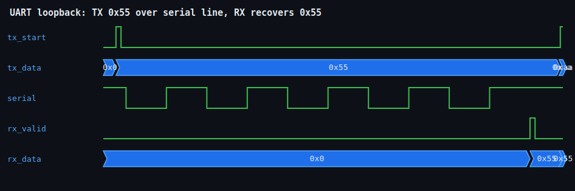

<h1 align="center">UART CONTROLLER</h1>

<p align="center"><b>A parameterized 8N1 UART transmitter and receiver in synthesizable Verilog, verified with a self-checking loopback testbench on an open-source flow.</b></p>

<p align="center">
  
  
  
</p>

<p align="center">Author: <b>Avinash Kollu</b> · GitHub: <a href="https://github.com/avinashkollu-git">@avinashkollu-git</a></p>

---

## Overview

This project implements a Universal Asynchronous Receiver/Transmitter (UART) in RTL Verilog. The transmitter serializes a parallel byte onto a single wire; the receiver recovers it back into a parallel byte with a data-valid strobe. Framing is **8N1** (1 start bit, 8 data bits, no parity, 1 stop bit) and data is sent **LSB-first**.

Both blocks are fully parameterized by `CLK_FREQ` and `BAUD_RATE`. The bit period in clock cycles is derived automatically as `CLKS_PER_BIT = CLK_FREQ / BAUD_RATE`, so the same RTL retargets to any clock or baud rate by changing two parameters.

## Features

- **8N1 framing**, LSB-first serialization and deserialization
- **Configurable baud rate** via `CLK_FREQ` / `BAUD_RATE` parameters (`CLKS_PER_BIT = CLK_FREQ / BAUD_RATE`)
- **Mid-bit sampling** in the receiver for maximum timing margin against clock skew
- **2-flop synchronizer** on the asynchronous `rx` input for metastability hygiene across the clock-domain crossing
- **One-cycle `rx_valid` strobe** for clean, glitch-free handshaking with downstream logic
- **Fully parameterized, reusable IP** — no hard-coded timing constants

## Block Diagram

```text
                          ┌───────────────────┐
        parallel in       │                   │   serial out
   tx_data[7:0] ────────► │      uart_tx      │ ──────────────┐
        tx_start ───────► │  (IDLE→START→DATA │                │
                          │   →STOP→DONE FSM) │                │  tx  (serial line, 8N1)
        tx_busy  ◄─────── │                   │                │
                          └───────────────────┘                ▼
                                                       ┌───────────────────┐
                                                       │                   │
                                              rx ────► │   2-FF sync       │
                                          (async in)   │        │          │
                                                       │        ▼          │
                                                       │      uart_rx      │ ──► rx_data[7:0]
                                                       │  (mid-bit sample) │ ──► rx_valid (1 clk)
                                                       └───────────────────┘

                          ┌───────────────────┐
              clk ──────► │  Baud generator   │  counts to CLKS_PER_BIT = CLK_FREQ / BAUD_RATE
                          │  (shared timing)  │  → drives one bit-period tick for TX and RX
                          └───────────────────┘
```

## Repository Layout

```text
uart-controller/
├── rtl/
│   ├── uart_tx.v          # Transmitter: 5-state FSM (IDLE/START/DATA/STOP/DONE), drives tx, tx_busy
│   └── uart_rx.v          # Receiver: 2-FF synchronizer, mid-bit sampling, rx_data + rx_valid
├── tb/
│   └── tb_uart.v          # Self-checking loopback testbench (TX → RX)
├── tools/
│   └── vcd2svg.py         # Converts a .vcd dump to an SVG waveform
├── docs/
│   └── uart_wave.svg      # Committed reference waveform
├── Makefile               # `make test`, `make wave`
├── LICENSE                # MIT
└── README.md
```

## Simulation & Results

Run the self-checking testbench (compile + simulate) with Icarus Verilog:

```bash
make test      # compile RTL + testbench and run the loopback simulation
make wave      # regenerate docs/uart_wave.svg from the simulation dump
```

The testbench wires the transmitter's output directly into the receiver's input and checks that every byte sent is received intact:

| # | Byte Sent | Byte Received | Result |
|---|-----------|---------------|--------|
| 1 | `0x55`    | `0x55`        | PASS   |
| 2 | `0xAA`    | `0xAA`        | PASS   |
| 3 | `0x00`    | `0x00`        | PASS   |
| 4 | `0xFF`    | `0xFF`        | PASS   |
| 5 | `0x3C`    | `0x3C`        | PASS   |

```text
RESULT: ALL TESTS PASSED
```

## Waveform



Transmitting `0x55` drives a start bit followed by the eight data bits LSB-first and a stop bit onto the serial line; the receiver samples each bit at mid-period, recovers the byte as `0x55`, and asserts `rx_valid` for one clock cycle.

## Design Notes

**Mid-bit sampling.** The receiver waits half a bit period after detecting the start edge, then samples every subsequent bit at its center. Sampling at the middle of each bit maximizes the distance from both bit-cell edges, giving the largest possible tolerance to baud mismatch, jitter, and clock skew between transmitter and receiver.

**Clock-domain crossing.** The incoming `rx` line is asynchronous to the receiver's clock, so a rising or falling edge can violate flip-flop setup/hold and drive a register metastable. A two-flop synchronizer resamples `rx` into the local clock domain before any logic uses it, letting a potentially metastable value settle and keeping metastability from propagating into the FSM and datapath.

## Skills Demonstrated

- Finite-state-machine design (5-state transmitter FSM)
- Synthesizable RTL coding in Verilog
- Serial protocol implementation (UART 8N1, LSB-first)
- Clock-domain crossing and metastability handling (2-FF synchronizer)
- Self-checking testbenches and simulation-based verification
- Parameterized, reusable IP design

## License

Released under the [MIT License](LICENSE).

Author: **Avinash Kollu** · GitHub: [avinashkollu-git](https://github.com/avinashkollu-git)
